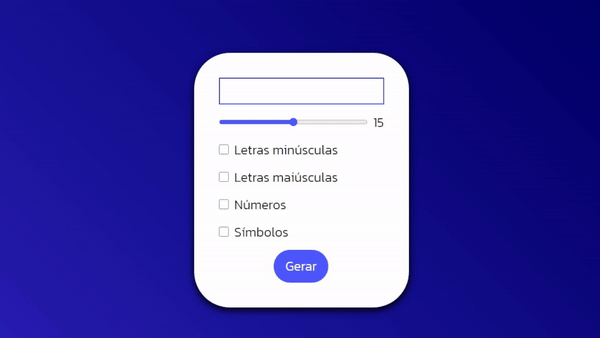
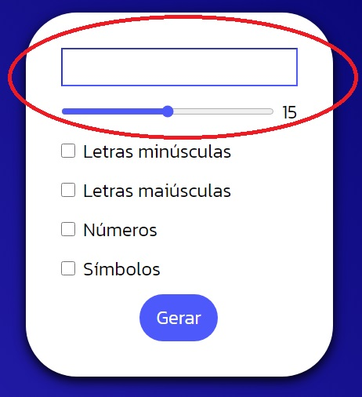
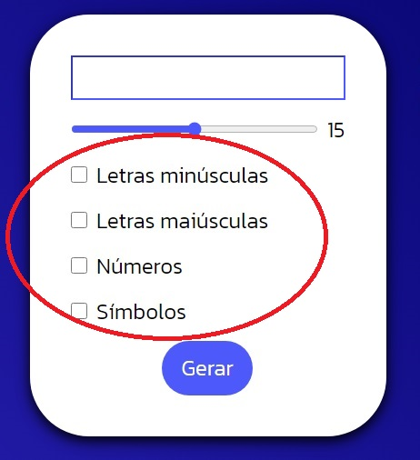
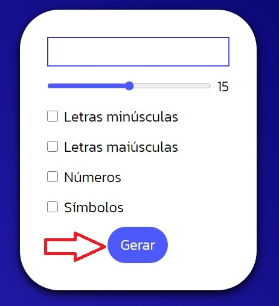

# 🔑 Gerador de Senha 

    

## 🎯 Sobre o que se trata?
Com o intuito de práticar os conhecimentos de JavaScript que estou absorvendo e um pouco que sei de HTML5 e CSS3, resolvi criar um gerador de senha aleatória.

## ⚙️ Como funciona? 

Ao abrir o site, o navegador logo de cara mostrará uma caixa onde será visualizada a senha gerada e a barra horizontal que determina quantos caracteres a senha possuíra, sendo no mínimo 6 e no máximo 24.

    

Prosseguindo logo abaixo, haverá quatro botões para dizer ao programa o que é permitido conter na senha, sendo obrigatório a seleção de pelo menos um deles para criá-la com sucesso. Eles são: Letras minúsculas, Letras maiúsculas, Números e/ou Símbolos.

    

Após confirmar todas as informações, basta clicar com o mouse sobre o botão "Gerar" e sua senha aleatória será gerada. A cada clique, uma senha diferente é gerada, mesmo possuindo as mesmas características e tamanho.

    

